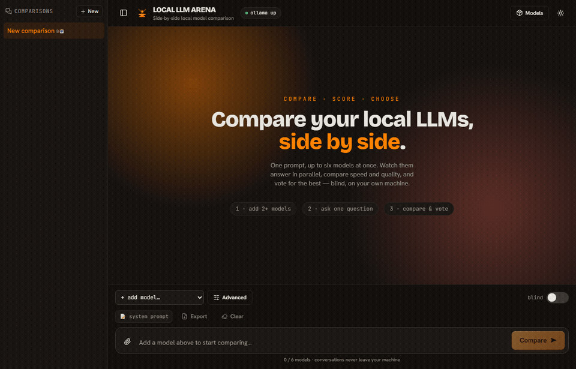
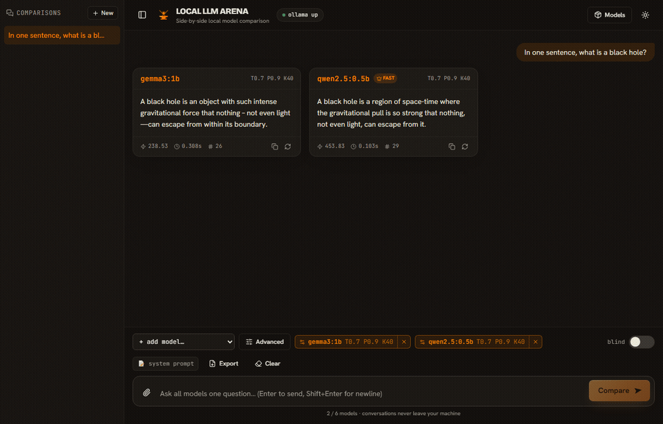
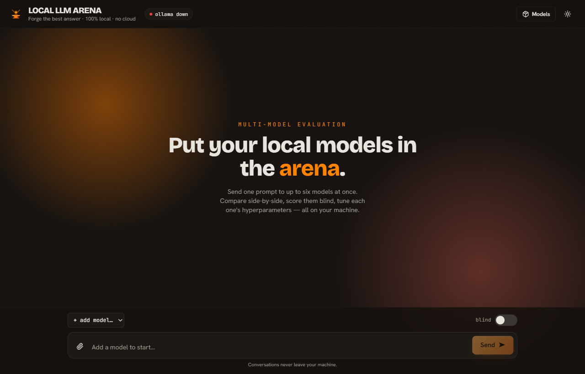
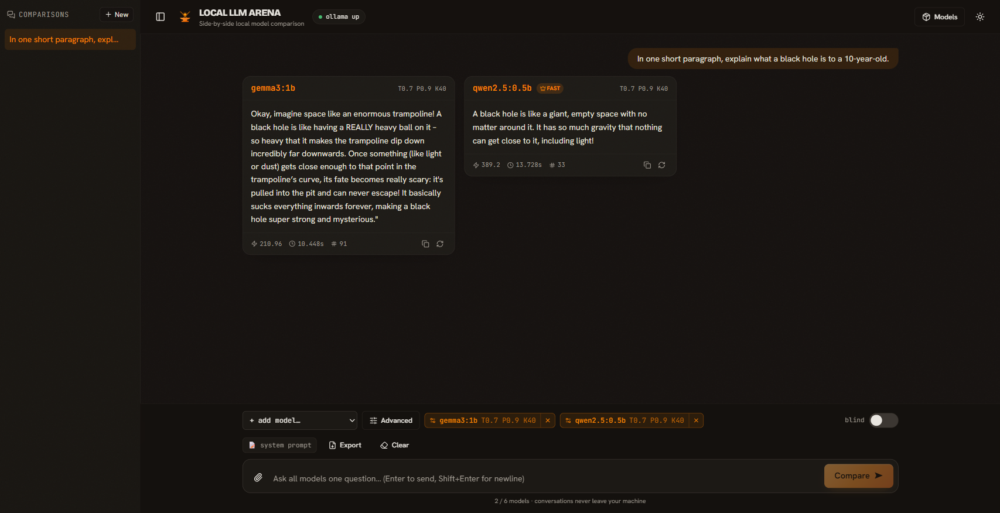

<div align="center">

# ⚔️ Local LLM Arena

**Compare your local LLMs side by side — stream, score, and pick the best, 100% on your machine.**

[](https://github.com/sammy995/Local-LLM-Arena/actions/workflows/ci.yml)
[](LICENSE)




<sub>One prompt → every model answers in parallel, with live metrics and a 👑 on the fastest.</sub>

</div>

---

<div align="center">

**[Features](#features)** · **[Quick start](#quick-start-one-command)** · **[How it works](#how-it-works)** · **[Tech stack](#tech-stack)** · **[Development](#development)**

</div>

---

## What it is

Local LLM Arena sends **one prompt to up to six local models at once** and shows their
answers **side by side**, streaming in real time. Compare speed and quality, run the
same model at different settings, and vote for the best answer **blind** — without ever
sending a byte to the cloud.

It runs entirely against a local [Ollama](https://ollama.com) instance. No API keys, no
accounts, no telemetry. Built for prompt engineers, researchers, and anyone evaluating
models on private or sensitive data.

> Comparison is the point. A single-model chat is just an arena with one model in it.

## Features

- **🆚 Side-by-side comparison** — one prompt → up to 6 models answering in parallel,
  each in its own streaming card.
- **📊 Compare metrics** — tokens/sec, time-to-first-token, and token count per model,
  with a 👑 crown on the fastest.
- **🎭 Blind evaluation** — hide model names (“Model A/B/C”), randomize order, vote 👍/👎,
  then reveal the mapping and vote tally. Voting locks on reveal to keep results honest.
- **🧑‍⚖️ Auto-judge (LLM-as-judge)** — score the answers automatically and pick a winner,
  using a **local** model or a **cloud** model with your own API key (Anthropic, OpenRouter,
  or any OpenAI-compatible endpoint). Answers are anonymized to the judge to avoid bias;
  cloud judging is opt-in with a clear privacy notice (keys stay in your browser, never logged).
- **🏆 Elo leaderboard** — a running, cross-comparison ranking of your models (an offline,
  private Chatbot Arena), built from judge scores and 👍/👎 votes via pairwise Elo.
- **🧪 Batch benchmark** — run a whole prompt set (paste or load `.txt`/`.jsonl`/`.csv`)
  across your models, auto-judge every prompt, and aggregate a reproducible Elo report —
  exportable as Markdown or JSON for sharing or publication.
- **⚙️ Per-model hyperparameters** — temperature, top-p, top-k, repeat-penalty,
  max-tokens, seed. Run the **same model at different settings** as separate entries.
- **📦 Model manager** — list, pull, and delete Ollama models from the UI.
- **📎 File attach** — drop in a text/code file; it’s read locally into your prompt.
- **💾 Export** — download a comparison as JSON (masked while blind, full after reveal).
- **🗂️ Sessions** — multiple saved comparisons, persisted locally.
- **🌗 Polished UI** — distinctive dark/light theme, sanitized markdown + code
  highlighting, tooltips on every control, keyboard-accessible.

<div align="center">

### 🎭 Blind evaluation in action



<sub>Hide the names, judge on quality alone, vote, then reveal who was who.</sub>

</div>

<details>
<summary>More screenshots</summary>

<div align="center">


</div>

</details>

## Quick start (one command)

**Prerequisites:** [Python 3.11+](https://python.org), [Node 20+](https://nodejs.org),
and [Ollama](https://ollama.com) running with at least one model:

```bash
ollama pull gemma3:1b
```

Then, from the project root:

```powershell
# Windows
./start.ps1
```

```bash
# macOS / Linux
./start.sh
```

This installs the backend (virtual env + deps) and frontend (npm + production build),
then serves the whole app as a **single local process** at **http://127.0.0.1:7860**.

### Or with Docker

Ollama runs on the host (keeping your GPU); the app runs in a container and reaches it:

```bash
docker compose up --build      # -> http://localhost:7860
```

## How it works

```
Browser (React 19 + Vite + Tailwind v4 + shadcn/ui)
   │  fetch + NDJSON stream  (same-origin /api/*)
   ▼
FastAPI (async, Pydantic-validated)
   │  ollama-python AsyncClient
   ▼
Ollama  ·  localhost:11434  ·  your models, your hardware
```

- One async backend is the single source of truth. Each model streams **one
  generation** (no double calls); all six hyperparameters flow through one code path;
  out-of-range values are rejected with `422`, never a `500`.
- The frontend streams each model independently, so cards fill in live and you can
  regenerate or stop any one of them.
- In production the SPA is built and served by FastAPI itself — one process, one URL,
  no CORS. In development, Vite hot-reloads and proxies `/api` to the backend.

See [docs/adr/0001-fastapi-react.md](docs/adr/0001-fastapi-react.md) for the
architecture decision record, and the live OpenAPI docs at `http://127.0.0.1:7860/docs`.

## Tech stack

| Layer | Choice |
|------|--------|
| Frontend | React 19, Vite 8, TypeScript, Tailwind v4, shadcn/ui + Radix, Zustand |
| Backend | FastAPI, Pydantic, `ollama-python` (async) |
| Inference | Ollama (local) |
| Fonts | Bricolage Grotesque · Hanken Grotesk · JetBrains Mono (bundled offline) |

## Development

```bash
# hot-reload dev (Vite on :5173 proxying to uvicorn on :7860)
./scripts/dev.ps1            # Windows

# or manually
cd backend  && python -m venv .venv && ./.venv/Scripts/python -m pip install -e ".[dev]"
            && uvicorn app.main:app --reload --port 7860
cd frontend && npm install && npm run dev
```

```bash
# tests
cd backend  && pytest          # API + hyperparameter passthrough
cd frontend && npm test        # store/instance helpers + NDJSON stream parser
```

## Project structure

```
backend/    FastAPI app — routers, services/ollama.py, schemas, tests
frontend/   React app — components/arena, store/arena.ts, lib (api, sse), styles
docs/       ADR, assets (screenshots)
start.ps1 · start.sh   one-command install & run
```

## Privacy

Everything runs locally. There are **no external network calls** — models run through
Ollama on your hardware, fonts are bundled, and conversation history lives only in your
browser’s local storage. Nothing is uploaded, logged remotely, or sent for training.

## Credits & License

Built on Ollama, FastAPI, React, Tailwind, shadcn/ui, Radix, and Uiverse-style
components — see [CREDITS.md](CREDITS.md). Licensed under the [MIT License](LICENSE).

> Uses [Ollama](https://ollama.com) (© Ollama, Inc.), a separate product with its own license.

<div align="center"><sub>Made for privacy-conscious AI practitioners.</sub></div>
