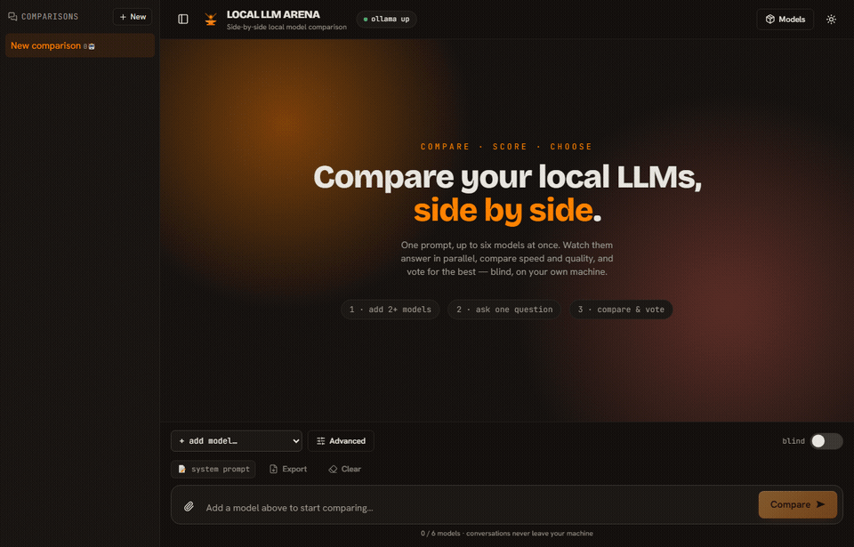
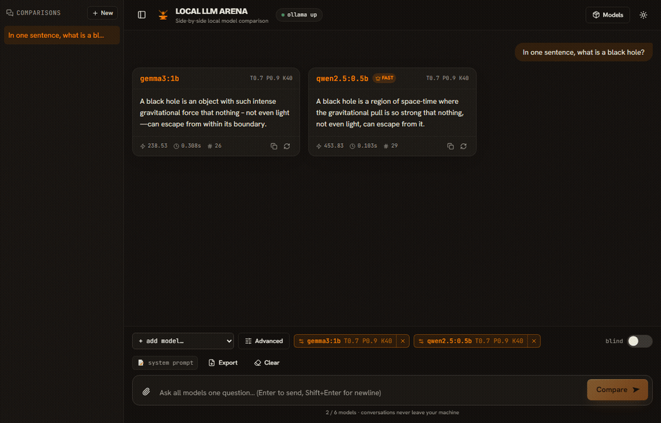
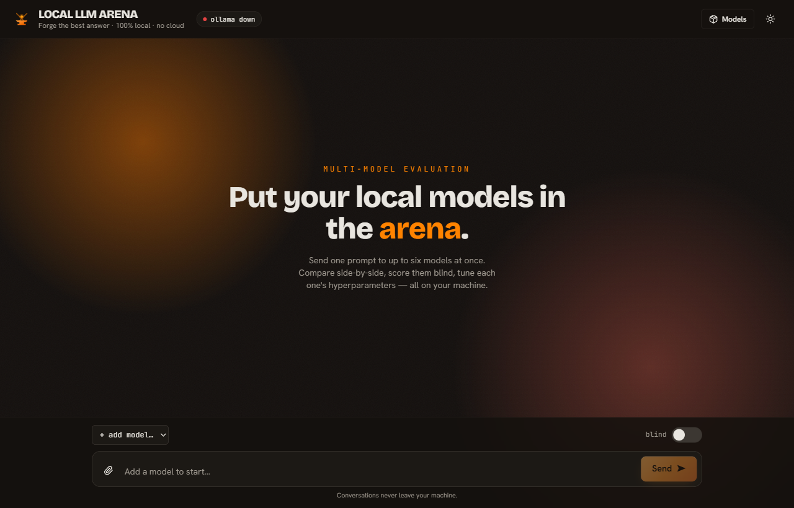
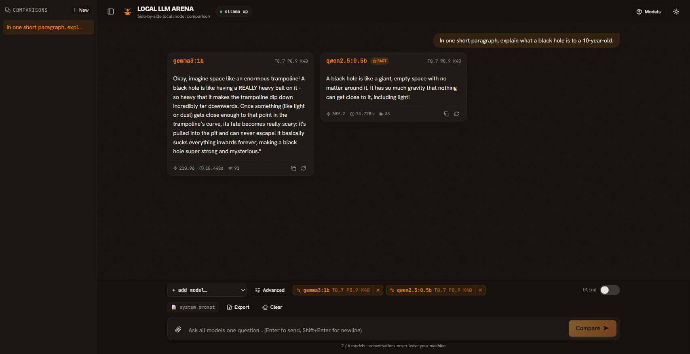

<div align="center">

# Local LLM Arena

One prompt. Up to six local models. Parallel streams, blind votes, a private Elo board.

[](https://github.com/sammy995/Local-LLM-Arena/actions/workflows/ci.yml)
[](LICENSE)


[Quick start](#run-it) · [What you get](#what-you-get) · [Technical report](docs/TECHNICAL_REPORT.md) · [mp4 with sound](https://github.com/sammy995/Local-LLM-Arena/blob/main/brag-output/brag.mp4)


</div>

You talk to Ollama on this machine. Nothing goes to a hosted chat API unless you opt into a cloud judge and paste your own key (that key stays in RAM).



## Run it

You need [Python 3.11+](https://python.org), [Node 20+](https://nodejs.org), and [Ollama](https://ollama.com) with at least one model:

```bash
ollama pull gemma3:1b
```

```powershell
# Windows
./start.ps1
```

```bash
# macOS / Linux
./start.sh
```

That installs the backend and frontend, then serves both from **http://127.0.0.1:7860**.

Docker (Ollama stays on the host so the GPU is still yours):

```bash
docker compose up --build
```

## What you get

- **Side-by-side streams**: one prompt, up to six models, each in its own card. Tokens/sec, time-to-first-token, token count. A FAST mark on the quickest card.
- **Blind vote**: names hide as Model A/B/C, order shuffles, you thumb up or down, then reveal. Votes lock on reveal.
- **LLM-as-judge**: a local model, or Anthropic / OpenRouter / any OpenAI-compatible endpoint with a key you type in. Candidates are anonymized. Order is randomized per call. Temperature is pinned at 0.
- **Private Elo**: pairwise ranking from votes and judge scores, with 95% bootstrap confidence intervals and a win matrix.
- **Batch benchmark**: paste or load a `.txt` / `.jsonl` / `.csv` prompt set, judge every item, export Markdown, native JSON, or [EvalPort](https://github.com/adhabnr-ux/evalport) ResultSets.
- **Per-model knobs**: temperature, top-p, top-k, repeat-penalty, max-tokens, seed. Same weights at two settings count as two entries.
- **Ollama from the UI**: list, pull, delete. Attach a local text/code file. Export the comparison as JSON (masked while blind).

<details>
<summary>Blind vote, then reveal</summary>



</details>

<details>
<summary>More screenshots</summary>




</details>

## Compared with other UIs

| | This repo | Open WebUI | LM Studio | lmsys Chatbot Arena |
| --- | :---: | :---: | :---: | :---: |
| Local, prompts stay on the box | yes | yes | yes | no |
| Up to 6 models in parallel | yes | yes | no | 2, random pair |
| Blind 👍/👎 | yes | no | no | yes |
| Local or BYO-key judge | yes | no | no | no |
| Private Elo + CIs + win matrix | yes | no | no | public Elo |
| Reproducible batch report | yes | no | no | no |
| Same model, two hyperparameter rows | yes | partial | yes | no |
| MIT | yes | yes | no | yes |

Open WebUI and LM Studio are chat clients. This is an eval bench you run on your own prompts.

## How the process is wired

```
Browser (React 19 + Vite + Tailwind v4)
   fetch + NDJSON  /api/*
     FastAPI
       ollama-python AsyncClient
         Ollama on localhost:11434
```

Each model runs **one** generation (no double call). All six hyperparameters take the same path. Out-of-range values return `422`, not `500`. Production FastAPI serves the built SPA: one process, no CORS. In development Vite proxies `/api`.

Architecture: [docs/adr/0001-fastapi-react.md](docs/adr/0001-fastapi-react.md). Live OpenAPI: `http://127.0.0.1:7860/docs`.

The [technical report](docs/TECHNICAL_REPORT.md) covers blind-vote bias controls, anonymized judging, pairwise Elo, and a limitations section.

## Development

```bash
./scripts/dev.ps1            # Windows: Vite :5173, uvicorn :7860

cd backend  && pytest
cd frontend && npm test
```

```
backend/    FastAPI
frontend/   React arena
docs/       ADR + screenshots
brag-output/  README GIF plus mp4 with sound
```

Fonts (Bricolage Grotesque, Hanken Grotesk, JetBrains Mono) ship in the frontend bundle. History lives in `localStorage`.

## License

[MIT](LICENSE). Credits in [CREDITS.md](CREDITS.md). Ollama is a separate product with its own license.
